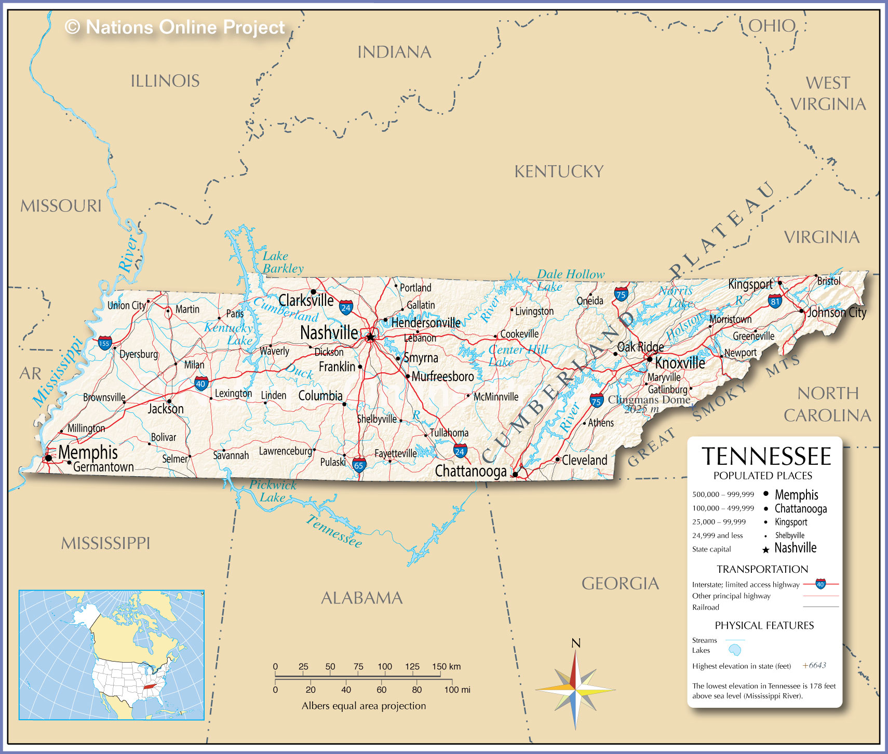

# Intoduction
The 2008 presidential election between John McCain and Barack Obama resulted in the unprecedented feat of the election of the United States' first African American president. This is the first presidential election that I remember being aware of, and as such, I wanted to find out to what extent my home state's electorate supported Barack Obama. 

Tennessee has three major metropolitan areas: Nashville, Memphis, and Knoxville. Their location can be seen below in Figure 1, provided from *[Nations Online](https://www.nationsonline.org/oneworld/map/USA/tennessee_map.htm)*\*.



In order to get an understanding of how many votes Barack Obama received in Tennessee during the 2008 election, we are going to look a the data from the county-level. Below we will use a choropleth map, boxplot, histogram, and scatter plot to visualize the results using data from the *[MIT Election Data & Science Lab](https://dataverse.harvard.edu/dataset.xhtml?persistentId=doi:10.7910/DVN/VOQCHQ)*. To reproduce the visualizations below, it is necessary to install and load the following packages before proceeding.

\***Note, I use italicized text to indicate text that is a URL to my references**

# Loading libraries
```{r, message=FALSE}
library(tidyverse)
library(urbnmapr)
library(RColorBrewer)
library(hrbrthemes)
```

# Loading data
Now, we will begin to take a closer look at the data by loading the .csv file into the R session.
```{r}
# Importing data from all states
county_results <- read.csv("countypres_2000-2016.csv")
```

# Cleaning data
I am following Hadley Wickham's *[tidy data](https://vita.had.co.nz/papers/tidy-data.pdf)* model to make sure that the data are formatted correctly so that using the `tidyverse` package is as simple as possible.

## Filtering for Tennessee
The MIT data includes all 50 states, so we are going to get rid of all states but Tennessee.
```{r}
# Narrowing to Tennessee only
county_results <- county_results %>% 
  filter(state == "Tennessee") %>% 
  select(-state_po, -office)
```

### Exporting .csv of all TN election data from 2000-2016
I am leaving this commented out so that it does not produce a new .csv very time; this is so that I can include the .csv in the project submission.
```{r}
# Writing .csv of full Tennessee data (for lab submission only)
# write_csv(county_results, "Tennessee.csv")
```

## Selecting necessary columns
Next, we are going to further narrow down the data to include only the necessary information. I added the FIPS column so that I can do a left join on the data later in the project.
```{r}
county_results <- county_results %>% 
  select(year, county, party, candidate, candidatevotes, totalvotes, FIPS)
```

## Renaming columns
In accordance to the tidy data format, I am renaming the columns for consistency. I also convert county_fips to a character so that when it is joined with another data frame later, it is the same class.
```{r}
county_results <- county_results %>% 
  rename(candidate_votes = candidatevotes) %>% 
  rename(total_votes = totalvotes) %>% 
  rename(county_fips = FIPS)

# Converting county_fips to characters
county_results$county_fips <- as.character(county_results$county_fips)
```

## Filtering to just one election year and political party
Now we save the data into a data frame only with results from 2008.
```{r}
county_results_08 <- county_results %>% 
  filter(year == 2008) %>% 
  filter(party == "democrat")
```

## Calculating percent of vote
Using the `mutate()` function, I can calculate the percent of votes Obama received. We will use this data to gauge his support in each county.
```{r}
county_results_08 <- county_results_08 %>% 
  mutate(percent_vote = 100 * (candidate_votes / total_votes))
```

### Exporting .csv of clean data
This .csv file includes data for Barack Obama's 2008 election results for all counties in Tennessee, and I am leaving this commented out because I only needed to use it once to produce the necessary .csv file for the project submission.
```{r}
# Writing .csv (for lab submission only)
# write_csv(county_results_08, "tn-2008-democrats.csv")
```

# Data visualization
The data is now ready to be visualized! We are going to use a choropleth map to see which counties had a higher percentage of votes for Obama; use a boxplot and histogram to see the data's spread; and a scatter plot to see if there might be any correlations.

## Choropleth Map
I am using the `urbanmapr` package and referencing their vignette which can be accessed *[here](https://github.com/UrbanInstitute/urbnmapr/blob/master/vignettes/introducing-urbnmapr.Rmd)* to create the following map.
```{r}
# Filtering counties data set to only Tennessee
tn_counties <- counties %>% 
  filter(state_name == "Tennessee")

# Creating map
tn_counties %>% 
  ggplot(aes(long, lat, group = group)) +
  geom_polygon(fill = "grey", color = "#ffffff", size = 0.25) +
  coord_map(projection = "albers", lat0 = 39, lat1 = 45) +
  theme_void()
```

### Merging data onto map
Here I am using `left_join()` to combine my data frame that contains election data with their data frame that contains the latitude and longitudes required for creating the map, and this will allow us to add color based on the percent of vote by county.
```{r, warning=FALSE}
# Left join
dem_results_08 <- left_join(county_results_08, tn_counties, by = "county_fips")

# Adding election results to map
dem_results_08 <-  dem_results_08 %>% 
  ggplot(aes(long, lat, group = group, fill = percent_vote)) +
  geom_polygon(color = "#ffffff", size = 0.25) +
  coord_map(projection = "albers", lat0 = 39, lat1 = 45) +
  theme_void()


# Adding color to map
dem_results_08 <- dem_results_08 +
  scale_fill_gradient(low = "#9ECAE1", high = "#2171B5") +
  theme(legend.position = "right",
        legend.direction = "vertical",
        legend.title = element_text(face = "bold", size = 11)) +
  labs(fill = "Percent of Votes \nReceived")

# Adding titles
dem_results_08 <- dem_results_08 +
  labs(title = "Percentage of Votes Received in Tennessee \nfor Barack Obama in 2008 Presidential Election",
       subtitle = "Carmen Canedo \n",
       caption = "\nSource: MIT Election Data & Science Lab | STAT 202, Summer 2020") +
  theme(plot.title = element_text(face = "bold"),
        plot.subtitle = element_text(face = "italic"),
        plot.caption = element_text(face = "plain"))

dem_results_08
```

This map shows us that Obama received the highest percentage of votes in Davidson, Shelby, and Haywood counties. Unsurprisingly, these are counties in which large metropolitan cities are. 

## Boxplot
I am now using my original data frame, `county_results_08`, to create a boxplot that visualizes the spread of the data.
```{r}
# Creating boxplot
bp_results <- county_results_08 %>% 
  ggplot(aes(x = percent_vote)) +
  geom_boxplot(fill = "#64aacf") +
  theme_classic()

# Adding text
bp_results <- bp_results +
  labs(x = "Percent of Votes Received",
       y = "",
       title = "Percent of Votes Cast for Barack Obama \nby Tennessee Democrats in 2008 Presidential Election",
       subtitle = "Carmen Canedo \n",
       caption = "\nSource: MIT Election Data & Science Lab | STAT 202, Summer 2020") +
  theme(axis.text.y = element_blank(),
        axis.ticks = element_blank(),
        plot.title = element_text(face = "bold"),
        plot.subtitle = element_text(face = "italic"),
        plot.caption = element_text(face = "plain"))
  

bp_results
```

It appears that only three counties had over 60% of votes go to Obama, and they are outliers.

## Histogram
Similarly to the boxplot, we use histograms to measure the spread of a data set. Our data is left-skewed, so I marked the median using a redline, as it is an unbiased estimator.
```{r}
# Creates base for histogram
hist_results <- county_results_08 %>% 
  ggplot(aes(x = percent_vote)) +
  geom_histogram(binwidth = 2,
                 color = "black",
                 fill = "light blue") +
  theme_minimal()

# Adds median line
hist_results <- hist_results +
  geom_vline(aes(xintercept = median(percent_vote)),
             color = "red",
             linetype = "dashed")

# Adding text
hist_results <- hist_results +
  labs(x = "Percent of Votes Received",
       y = "Count of Counties",
       title = "Percent of Votes Cast for Barack Obama \nby Tennessee Democrats in 2008 Presidential Election",
       subtitle = "Carmen Canedo \n",
       caption = "\nSource: MIT Election Data & Science Lab | STAT 202, Summer 2020") +
  theme(plot.title = element_text(face = "bold"),
        plot.subtitle = element_text(face = "italic"),
        plot.caption = element_text(face = "plain"))

hist_results
```

## Scatter Plot
This scatter plot helps us see yet again that most counties had very little votes go to Obama. The three outliers can be seen on the far right-hand side, near the 60% mark.
```{r}
# Creating scatter plot
sp_results <- county_results_08 %>% 
  ggplot(aes(x = percent_vote, y = total_votes)) +
  geom_point() +
  theme_minimal()

# Adding text
sp_results <- sp_results +
  labs(x = "Percent of Votes Received for Obama",
       y = "Total Votes",
       title = "Votes Recieved in Tennessee for Barack Obama \nin the 2008 Presidential Election",
       subtitle = "Carmen Canedo \n",
       caption = "\nSource: MIT Election Data & Science Lab | STAT 202, Summer 2020") +
    theme(plot.title = element_text(face = "bold"),
        plot.subtitle = element_text(face = "italic"),
        plot.caption = element_text(face = "plain"))

sp_results
```


# Conclusion
Ultimately, it seems that most counties in Tennessee ended up having the majority of votes go to the Republican candidate John McCain. The counties where Obama received the most votes are counties with the highest amount of people of color in the state, per the *[Tennessee Arts Commission](https://tnartscommission.org/tn-county-demographics/)*, and have some of the largest metro areas. The state capitol, Nashville, is located in Davidson County, where a third of the population is people of color. Shelby County, where Memphis is located, and Haywood County have the *[majority population of African Americans](https://en.wikipedia.org/wiki/Haywood_County,_Tennessee)*. Perhaps in future research, I will delve deeper into the data and see if there is a relationship between race and political party, but from a surface-level analysis, it appears that in Tennessee, the counties with a higher percentage of people of color had a higher percent of votes received for Obama.